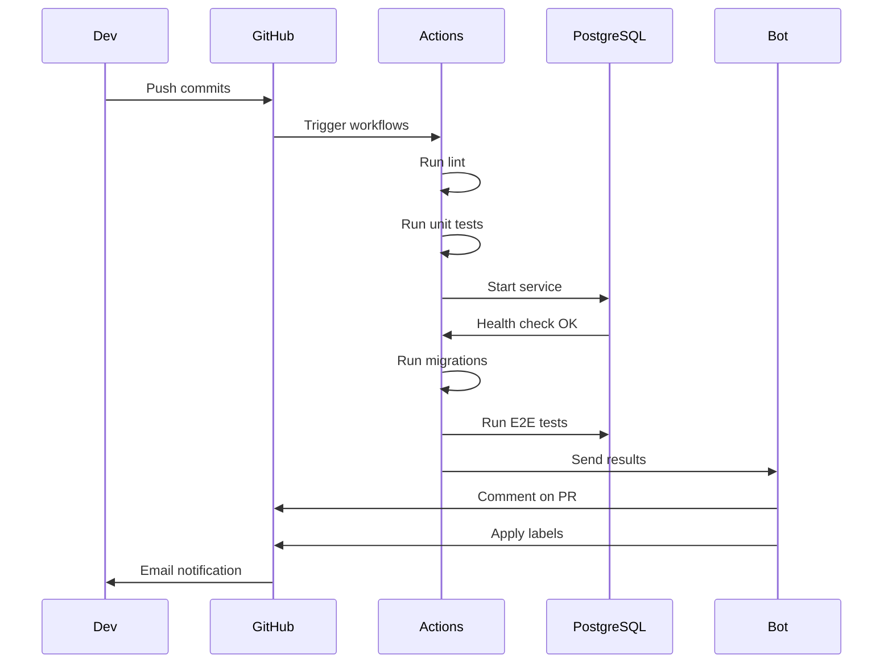
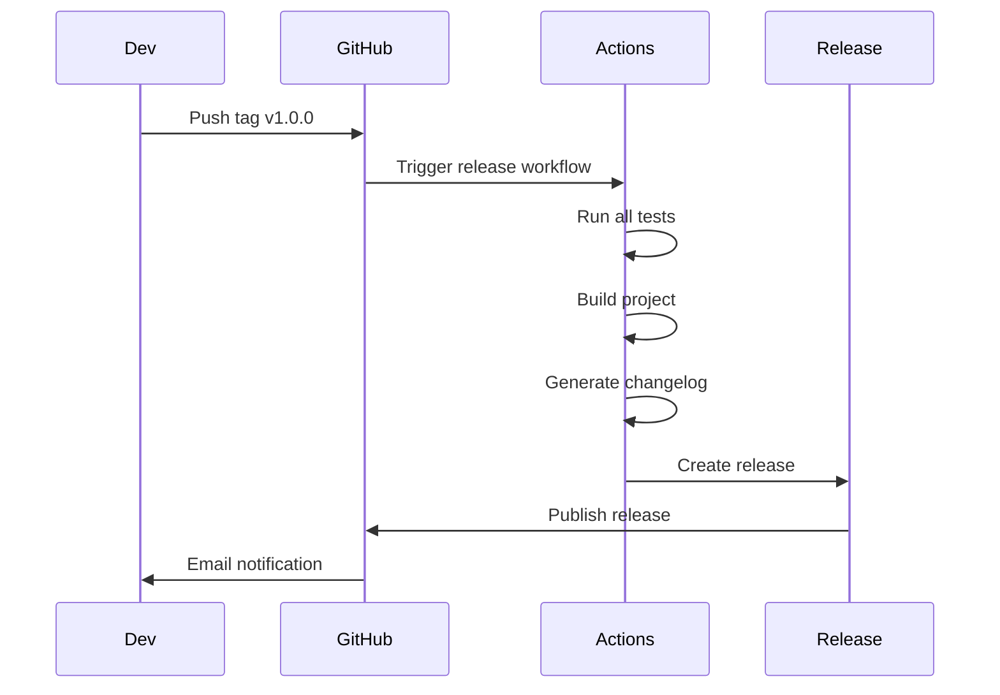

# 🏗️ Arquitectura del CI/CD

Documentación de la arquitectura completa del sistema de CI/CD de Clean Orders.

## 📊 Visión General

```
┌─────────────────────────────────────────────────────────────┐
│                    GitHub Repository                         │
│                                                              │
│  ┌──────────────┐  ┌──────────────┐  ┌──────────────┐      │
│  │   Source     │  │  Workflows   │  │   Actions    │      │
│  │    Code      │──▶│   (.yml)     │──▶│   Runs       │      │
│  └──────────────┘  └──────────────┘  └──────────────┘      │
│                            │                                 │
└────────────────────────────┼─────────────────────────────────┘
                             │
                             ▼
┌─────────────────────────────────────────────────────────────┐
│                   GitHub Actions Runner                      │
│                                                              │
│  ┌──────────────────────────────────────────────────────┐  │
│  │  Job 1: Lint        │  Job 2: Unit Tests              │  │
│  │  • Checkout         │  • Checkout                      │  │
│  │  • Setup Node       │  • Setup Node                    │  │
│  │  • npm ci           │  • npm ci                        │  │
│  │  • npm run build    │  • npm run test:unit             │  │
│  └──────────────────────────────────────────────────────┘  │
│                                                              │
│  ┌──────────────────────────────────────────────────────┐  │
│  │  Job 3: E2E Tests   │  Job 4: Coverage                │  │
│  │  [PostgreSQL]       │  • Checkout                      │  │
│  │  • Setup DB         │  • Setup Node                    │  │
│  │  • Run migrations   │  • npm ci                        │  │
│  │  • npm run test:e2e │  • npm test --coverage           │  │
│  └──────────────────────────────────────────────────────┘  │
└─────────────────────────────────────────────────────────────┘
                             │
                             ▼
┌─────────────────────────────────────────────────────────────┐
│                    Status & Feedback                         │
│                                                              │
│  • Commit status checks  • PR comments                      │
│  • Email notifications   • Labels                           │
│  • Badge updates         • GitHub Releases                  │
└─────────────────────────────────────────────────────────────┘
```

## 🔄 Workflows

### 1. CI Workflow (`ci.yml`)

**Propósito**: Pipeline principal de integración continua

**Triggers**:
- `push` a `main` o `develop`
- `pull_request` a `main` o `develop`

**Jobs**:
1. **lint**: Type checking con TypeScript
2. **unit-tests**: Tests de dominio y aceptación
3. **e2e-tests**: Tests end-to-end con PostgreSQL
4. **coverage**: Reporte de cobertura

**Paralelismo**: Todos los jobs corren en paralelo

**Services**:
- PostgreSQL 16 Alpine (solo para e2e-tests)

### 2. PR Checks Workflow (`pr-checks.yml`)

**Propósito**: Validación específica de Pull Requests

**Triggers**:
- `pull_request` (opened, synchronize, reopened)

**Jobs**:
1. **pr-info**: Información de la PR
2. **pr-size**: Validación de tamaño
3. **all-tests**: Ejecuta todos los tests
4. **code-quality**: ESLint y Prettier (opcional)

**Features**:
- Comentarios automáticos con resultados
- Warning si PR > 500 líneas
- Integración con PostgreSQL service

### 3. Auto Label Workflow (`auto-label.yml`)

**Propósito**: Etiquetado automático de PRs

**Triggers**:
- `pull_request` (opened, synchronize)

**Lógica**:
```javascript
for cada archivo modificado:
  if archivo.includes('src/domain/'):
    agregar label 'domain'
  if archivo.includes('src/application/'):
    agregar label 'application'
  // ... etc

calcular tamaño total:
  if cambios < 50:
    agregar 'size/XS'
  else if cambios < 200:
    agregar 'size/S'
  // ... etc
```

**Labels automáticos**:
- Por capa: domain, application, infrastructure, tests
- Por tamaño: size/XS, S, M, L, XL
- Por tipo: documentation, ci/cd, database

### 4. Dependency Review Workflow (`dependency-review.yml`)

**Propósito**: Seguridad y auditoría de dependencias

**Triggers**:
- `pull_request` con cambios en `package.json` o `package-lock.json`

**Jobs**:
1. **dependency-review**: GitHub Dependency Review Action
2. **security-audit**: npm audit

**Acciones**:
- Falla si hay vulnerabilidades moderadas o superiores
- Comenta en la PR con resultados del audit
- Bloquea merge si hay problemas de seguridad

### 5. Release Workflow (`release.yml`)

**Propósito**: Automatización de releases

**Triggers**:
- `push` de tags con patrón `v*.*.*`

**Jobs**:
1. Build del proyecto
2. Ejecución de todos los tests
3. Generación de changelog automático
4. Creación de GitHub Release
5. Upload de artifacts (.tar.gz)

**Proceso**:
```bash
git tag v1.0.0
git push origin --tags
↓
Workflow se activa automáticamente
↓
Tests pasan
↓
Se crea release en GitHub
↓
Artifacts disponibles para download
```

## 🔐 Permisos

### Permisos Requeridos

Cada workflow declara sus permisos mínimos:

```yaml
# ci.yml
permissions:
  contents: read
  checks: write

# pr-checks.yml
permissions:
  contents: read
  pull-requests: write
  checks: write

# auto-label.yml
permissions:
  contents: read
  pull-requests: write

# release.yml
permissions:
  contents: write
```

### Configuración de Repositorio

En `Settings` → `Actions` → `General`:

```
✅ Read and write permissions
✅ Allow GitHub Actions to create and approve pull requests
```

## 🏃 Runners

### GitHub-hosted Runners

Todos los workflows usan `ubuntu-latest`:

**Specs**:
- 2-core CPU
- 7 GB RAM
- 14 GB SSD
- Ubuntu 22.04

**Quota**:
- Repos públicos: Ilimitado
- Repos privados: 2000 minutos/mes (gratis)

### Costo Estimado

| Workflow | Duración | Ejecuciones/día | Total/día |
|----------|----------|-----------------|-----------|
| CI | 3-5 min | 5-10 | 25-50 min |
| PR Checks | 4-6 min | 3-5 | 15-30 min |
| Auto Label | <1 min | 3-5 | 3-5 min |
| Dependency | 2-3 min | 0-2 | 0-6 min |
| **Total** | - | - | **43-91 min/día** |

**Mensual**: ~1,300-2,730 minutos (dentro del límite gratuito de 2,000)

## 🗄️ Services

### PostgreSQL Service

Usado en `e2e-tests` y `all-tests`:

```yaml
services:
  postgres:
    image: postgres:16-alpine
    env:
      POSTGRES_USER: orders_user
      POSTGRES_PASSWORD: orders_pass
      POSTGRES_DB: orders_db
    ports:
      - 5432:5432
    options: >-
      --health-cmd pg_isready
      --health-interval 10s
      --health-timeout 5s
      --health-retries 5
```

**Features**:
- Health checks automáticos
- Port mapping a localhost
- Variables de entorno inyectadas
- Aislamiento entre jobs

**Lifecycle**:
```
Job start → PostgreSQL container inicia
         → Health checks (hasta 5 reintentos)
         → Cuando healthy, job continúa
         → Tests se ejecutan
         → Job termina → Container se destruye
```

## 📦 Caché

### Node Modules Cache

```yaml
- uses: actions/setup-node@v4
  with:
    node-version: '20'
    cache: 'npm'  # ← Cachea node_modules
```

**Funcionamiento**:
1. Primera ejecución: `npm ci` instala todo (~2 min)
2. Se guarda cache de `node_modules`
3. Siguientes ejecuciones: Restaura cache (~10s) + valida

**Key**: Basado en hash de `package-lock.json`

**Invalidación**: Cuando `package-lock.json` cambia

## 🔗 Integrations

### GitHub Integrations

- **Status Checks**: En commits y PRs
- **Comments**: Bot comenta resultados
- **Labels**: Aplicados automáticamente
- **Releases**: Creados automáticamente
- **Notifications**: Email en fallos

### External Services (Opcionales)

Configurables pero no requeridos:

- **Codecov**: Coverage tracking
- **Slack**: Notificaciones
- **Sentry**: Error tracking
- **Datadog**: Métricas

## 🔄 Flujo de Datos

### En una Pull Request



### En un Release



## 🎨 Arquitectura de Decisiones

### Por qué GitHub Actions

✅ **Ventajas**:
- Integración nativa con GitHub
- 2000 minutos gratis para repos privados
- Ilimitado para repos públicos
- Ecosistema de actions reutilizables
- Configuración como código (YAML)

❌ **Desventajas**:
- Menos flexible que Jenkins
- Debugging más difícil que local
- Vendor lock-in

### Por qué 5 Workflows Separados

En lugar de un mega-workflow:

✅ **Beneficios**:
- Separación de concerns
- Triggers independientes
- Más fácil de mantener
- Más rápido (paralelismo)
- Logs más claros

❌ **Trade-offs**:
- Más archivos YAML
- Código duplicado en setup

### Por qué PostgreSQL Service

En lugar de mocks para E2E:

✅ **Beneficios**:
- Tests más realistas
- Verifica migraciones
- Detecta bugs de SQL
- Prueba transacciones
- Valida performance

❌ **Trade-offs**:
- Tests más lentos (~2min vs ~10s)
- Más complejo de configurar
- Requiere migrations

## 📊 Monitoreo

### Métricas Clave

1. **Success Rate**: % workflows que pasan
2. **Average Duration**: Tiempo promedio
3. **Flakiness**: Tests que fallan intermitentemente
4. **Queue Time**: Tiempo esperando runner

Ver en: `Actions` → Workflow específico → `Analytics`

### Alerts

Configurables (no incluidos por defecto):

```yaml
# Ejemplo: Slack notification en fallo
- name: Slack Notification
  if: failure()
  uses: 8398a7/action-slack@v3
  with:
    status: ${{ job.status }}
    webhook_url: ${{ secrets.SLACK_WEBHOOK }}
```

## 🔧 Extensibilidad

### Agregar Nuevo Workflow

1. Crear `.github/workflows/nuevo.yml`
2. Definir triggers y jobs
3. Documentar en este archivo
4. Actualizar branch protection si necesario

### Agregar Nuevo Job a Workflow Existente

1. Editar workflow YAML
2. Agregar job con dependencias si aplica
3. Actualizar documentación
4. Probar con PR de prueba

### Agregar Service

```yaml
services:
  redis:
    image: redis:alpine
    ports:
      - 6379:6379
```

## 📚 Referencias

- [GitHub Actions Docs](https://docs.github.com/en/actions)
- [Workflow Syntax](https://docs.github.com/en/actions/reference/workflow-syntax-for-github-actions)
- [Service Containers](https://docs.github.com/en/actions/using-containerized-services)
- [Security Best Practices](https://docs.github.com/en/actions/security-guides/security-hardening-for-github-actions)

---

**Última actualización**: 2025-11-28
**Versión**: 1.0.0
