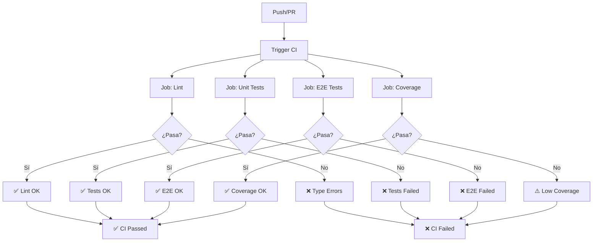

# 🔄 CI Workflow - Integración Continua

Documentación completa del workflow principal de CI.

## 📋 Información General

- **Archivo**: [`.github/workflows/ci.yml`](../../workflows/ci.yml)
- **Triggers**: Push a `main`/`develop`, Pull Requests
- **Tiempo promedio**: 3-5 minutos
- **Costo**: ~15-20 minutos de CI por día (GitHub Actions gratuito: 2000 min/mes)

## 🎯 Propósito

El workflow de CI ejecuta todos los checks de calidad para garantizar que:

- ✅ El código compila sin errores de TypeScript
- ✅ Todos los tests unitarios pasan
- ✅ Todos los tests E2E pasan con PostgreSQL real
- ✅ No hay regresiones
- ✅ El código está listo para merge

## 📊 Diagrama de Flujo



## 🔧 Jobs Detallados

### Job 1: Lint & Type Check

**Propósito**: Verificar que el código compila sin errores de TypeScript.

```yaml
lint:
  runs-on: ubuntu-latest
  steps:
    - Checkout code
    - Setup Node.js 20
    - Install dependencies (npm ci)
    - Type check (npm run build)
```

**Duración**: ~1-2 minutos

**Falla si**:
- Errores de sintaxis TypeScript
- Tipos incompatibles
- Importaciones faltantes
- Configuración de tsconfig inválida

**Cómo debuggear**:
```bash
# Ejecutar localmente
npm run build

# Ver errores detallados
npx tsc --noEmit
```

### Job 2: Unit Tests

**Propósito**: Ejecutar tests de dominio y aceptación.

```yaml
unit-tests:
  runs-on: ubuntu-latest
  steps:
    - Checkout code
    - Setup Node.js 20
    - Install dependencies
    - Run unit tests (npm run test:unit)
```

**Duración**: ~1-2 minutos

**Tests ejecutados**:
- Domain tests (148 tests)
  - Value Objects
  - Entities
  - Domain Events
- Acceptance tests (44 tests)
  - Use cases con test doubles
  - DTO validation
  - Error handling

**Falla si**:
- Algún test falla
- Assertion no cumplida
- Timeout de test

**Cómo debuggear**:
```bash
# Ejecutar localmente
npm run test:unit

# Ejecutar test específico
npm run test:unit -- OrderId.test.ts

# Modo watch para debugging
npm run test:watch
```

### Job 3: E2E Tests

**Propósito**: Verificar integración completa con PostgreSQL.

```yaml
e2e-tests:
  runs-on: ubuntu-latest
  services:
    postgres:
      image: postgres:16-alpine
      env:
        POSTGRES_USER: orders_user
        POSTGRES_PASSWORD: orders_pass
        POSTGRES_DB: orders_db
      ports:
        - 5432:5432
      options: >-
        --health-cmd pg_isready
        --health-interval 10s
        --health-timeout 5s
        --health-retries 5
  steps:
    - Checkout code
    - Setup Node.js 20
    - Install dependencies
    - Run migrations
    - Run E2E tests
```

**Duración**: ~2-3 minutos

**Tests ejecutados**:
- CreateOrder E2E (8 tests)
- AddItemToOrder E2E (10 tests)
- OutboxDispatcher E2E (10 tests)

**Features únicas**:
- PostgreSQL real como service
- Migraciones ejecutadas antes de tests
- Tabla outbox verificada
- Transactional outbox pattern probado

**Falla si**:
- PostgreSQL no está healthy
- Migraciones fallan
- Tests E2E fallan
- Tabla outbox no existe

**Cómo debuggear**:
```bash
# Ejecutar localmente
npm run db:up
npm run db:migrate
npm run test:e2e

# Ver logs de PostgreSQL
docker logs clean-orders-db

# Conectar a la BD para inspeccionar
docker exec -it clean-orders-db psql -U orders_user -d orders_db
```

### Job 4: Coverage (Opcional)

**Propósito**: Generar reporte de cobertura de tests.

```yaml
coverage:
  runs-on: ubuntu-latest
  steps:
    - Checkout code
    - Setup Node.js 20
    - Install dependencies
    - Run tests with coverage
    - Upload to Codecov (si está configurado)
```

**Duración**: ~1-2 minutos

**Métricas**:
- Line coverage
- Branch coverage
- Function coverage
- Statement coverage

**Nota**: El upload a Codecov está deshabilitado por defecto. Activar con:

```yaml
# En ci.yml, cambiar:
if: false  # → if: true
```

## 🔄 Flujo de Ejecución

### En Push a main/develop

```bash
1. Se hace push a main
2. CI se activa automáticamente
3. Los 4 jobs se ejecutan en paralelo
4. Resultados visibles en:
   - Pestaña Actions de GitHub
   - Commit status checks
5. Si falla, se notifica vía email
```

### En Pull Request

```bash
1. Se crea/actualiza una PR
2. CI se activa automáticamente
3. Los 4 jobs se ejecutan en paralelo
4. Resultados aparecen en la PR
5. Branch protection bloquea merge si falla
```

## 📊 Interpretación de Resultados

### ✅ Success (Todo pasó)

```
✓ Lint & Type Check (1m 23s)
✓ Unit Tests (1m 45s)
✓ E2E Tests (2m 12s)
✓ Test Coverage (1m 38s)

All checks have passed
```

**Acción**: La PR está lista para review/merge.

### ❌ Failure (Algo falló)

```
✓ Lint & Type Check (1m 23s)
✗ Unit Tests (1m 45s)
✓ E2E Tests (2m 12s)
✓ Test Coverage (1m 38s)

Some checks have failed
```

**Acción**:
1. Click en el check fallido
2. Ver logs
3. Reproducir localmente
4. Corregir
5. Push de nuevo

### ⚠️ Warning (Completó con warnings)

```
✓ Lint & Type Check (1m 23s)
✓ Unit Tests (1m 45s)
✓ E2E Tests (2m 12s)
⚠ Test Coverage (1m 38s) - Low coverage
```

**Acción**: Agregar más tests para mejorar coverage.

## 🐛 Troubleshooting

### "npm ci" falla

**Problema**: Dependencias no se instalan.

**Solución**:
```bash
# Verificar package-lock.json
git status package-lock.json

# Regenerar si está corrupto
rm package-lock.json
npm install
git add package-lock.json
git commit -m "fix: regenerate package-lock.json"
```

### Tests pasan localmente pero fallan en CI

**Problema**: Diferencias de entorno.

**Solución**:
```bash
# Reproducir ambiente de CI exacto
docker run -it \
  -v $(pwd):/app \
  -w /app \
  node:20-alpine \
  sh -c "npm ci && npm run test:unit"
```

### PostgreSQL service unhealthy

**Problema**: PostgreSQL no inicia en CI.

**Solución**: Ya configurado con health checks. Si persiste:
- Verificar imagen: `postgres:16-alpine`
- Verificar variables de entorno
- Revisar logs en GitHub Actions

### E2E tests timeout

**Problema**: Tests E2E toman demasiado tiempo.

**Solución**:
```bash
# Aumentar timeout en vitest.config.ts
export default defineConfig({
  test: {
    testTimeout: 30000, // 30 segundos
  },
})
```

## ⚡ Optimizaciones

### Caché de Dependencias

Ya configurado:
```yaml
- uses: actions/setup-node@v4
  with:
    cache: 'npm'  # ← Cachea node_modules
```

**Beneficio**: Primera ejecución ~2min, siguientes ~30s para install.

### Parallel Jobs

Los jobs se ejecutan en paralelo:

```
┌─────────────┐  ┌─────────────┐  ┌─────────────┐
│    Lint     │  │ Unit Tests  │  │  E2E Tests  │
│   ~1 min    │  │   ~2 min    │  │   ~3 min    │
└─────────────┘  └─────────────┘  └─────────────┘
         └──────────┬──────────┘
              Total: ~3 min
```

Sin paralelismo sería ~6 min.

### Conditional Jobs

Coverage solo en `main`:
```yaml
coverage:
  if: github.ref == 'refs/heads/main'
```

## 📈 Métricas

Tracking automático en GitHub Actions:

- **Success Rate**: % de workflows que pasan
- **Average Duration**: Tiempo promedio de ejecución
- **Cost**: Minutos de CI consumidos

Ver en: `Actions` → `Workflows` → `CI` → `Analytics`

## 🔗 Referencias

- [Workflow file](../../workflows/ci.yml)
- [GitHub Actions Docs](https://docs.github.com/en/actions)
- [Vitest Docs](https://vitest.dev)
- [PostgreSQL in Actions](https://docs.github.com/en/actions/using-containerized-services/creating-postgresql-service-containers)

## 📚 Ver También

- [PR Checks Workflow](PR_CHECKS.md) - Checks específicos de PRs
- [Testing Guide](../guides/TESTING.md) - Cómo funcionan los tests
- [Debugging Guide](../guides/DEBUGGING.md) - Solucionar problemas

---

**Última actualización**: 2025-11-28
